# RELAY

**THE SELF-DRIVING STREAK**

RELAY deploys a budget-bounded autonomous runner into a user-owned vault that trades recurring DreamDEX Event Contracts on Somnia Shannon, settles from the oracle, and re-arms the next window.

> Deploy once. The streak runs itself.

A normal user deploys a bounded runner once. The runner continues through recurring 15-minute Event Contract windows. Results are settlement-backed and receipt-verifiable. This build is **Shannon testnet** (`chainId` **50312**). It is **not** mainnet.

[](https://shannon-explorer.somnia.network)
[](https://github.com/mohamedwael201193/relay/actions/workflows/ci.yml)
[](#testing--security--ci)
[](https://www.npmjs.com/package/@somnia-chain/markets-sdk/v/0.29.0)
[](https://www.npmjs.com/package/@somnia-chain/reactivity/v/0.2.1)

**Live app:** [relay-silk-one.vercel.app](https://relay-silk-one.vercel.app) · **API:** [relay-api-71gi.onrender.com/health](https://relay-api-71gi.onrender.com/health) · **Demo:** [youtu.be/Ei42-KT7bIo](https://youtu.be/Ei42-KT7bIo)

<p align="center">
  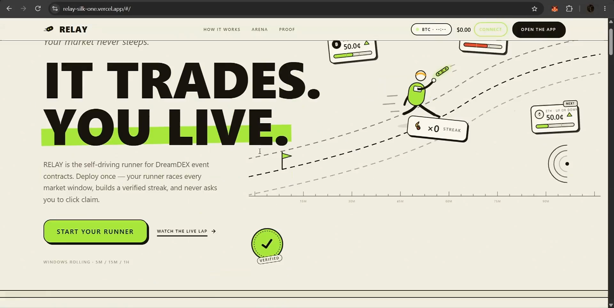
</p>
<p align="center"><sub>Landing on the live Shannon app. Not a mock.</sub></p>

---

## What is RELAY?

RELAY is a consumer product for DreamDEX Event Contracts: 15-minute BTC/ETH Up/Down windows with on-chain books, ERC-6909 positions, and a Shannon oracle. The venue already has a metronome. What it does not have is a runner a normal trader can leave alone.

You deploy a `RunnerVault` you own. You pick bias, budget, and stop-loss. Collateral stays in the vault. The RELAY operator may trade, mint, and redeem. It cannot withdraw. After that, the worker scans live windows, places real orders, waits for close, waits for the oracle, lets Somnia Reactivity push settlement into the vault when subscribed, redeems the winning side, recomputes streak from verified fills, and re-arms.

This repository is the product: Foundry contracts, TypeScript worker and API, pinned DreamDEX SDK + Reactivity, and the Next.js app. There is no second “demo mode” in production. `pnpm check:frontend-mocks` fails the build if production UI imports mocks.

---

## Why it exists

Event Contracts are the right primitive for a streak: a fresh binary window, capped risk, on-chain settlement. The terminal is still pick → bet → wait → claim → repeat. Nothing persists. A painted counter is not a streak. A server bot that holds user keys is not a vault.

RELAY exists so the market can keep moving after the human stops, with receipts a judge can open.

---

## The loop

<p align="center">
  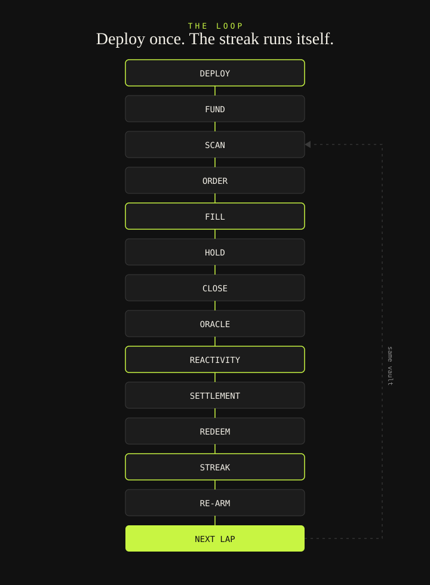
</p>

```
DEPLOY
  │
  ▼
FUND
  │
  ▼
SCAN ─────────────── live window, status == Trading
  │
  ▼
ORDER ────────────── Post-only, then IOC. Empty book can mintSet.
  │
  ▼
FILL ─────────────── OrderFilled logs. tx success ≠ fill.
  │
  ▼
HOLD → CLOSE
  │
  ▼
ORACLE ───────────── Shannon question on dev.oracle.somnia.host
  │
  ▼
REACTIVITY ───────── AnswerDelivered → vault _onEvent
  │
  ▼
SETTLEMENT ───────── LapSettled (fromCallback=true when subscribed)
  │
  ▼
REDEEM ───────────── winning ERC-6909 side into the vault
  │
  ▼
STREAK ───────────── wins / losses from redeemed fills
  │
  ▼
RE-ARM ───────────── next eligible 15m window
  │
  └──► NEXT LAP
```

Scan uses `listLiveBinaryMarkets` plus `getMarketOnchain` (`status == 1` / Trading). A 15-minute runner does not silently join a 60-second book. Order expiry is `expireTimestampNs` = market expiry. `UNKNOWN` IOC is not a lap.

---

## Architecture

Three planes. Nothing invented.

<p align="center">
  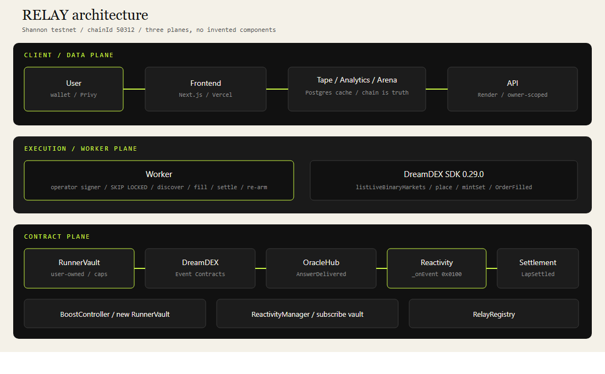
</p>

```
User ──► Frontend (Privy) ──► API
                 │
                 ▼
           RunnerVault ──► DreamDEX Event Contracts
                 │                │
                 │                ▼
                 │             OracleHub (AnswerDelivered)
                 │                │
                 ▼                ▼
           Reactivity ──► LapSettled ──► Redeem
                 │
                 ▼
        Tape / Analytics / Arena   (Postgres cache; chain is financial truth)
```

| Plane | What ships |
| --- | --- |
| Contract | `RunnerVault`, `RelayRegistry`, `ReactivityManager`, `BoostController` on Shannon |
| Execution | TypeScript worker (operator signer, `SKIP LOCKED` leases) + API on Render |
| Client / data | Next.js on Vercel. Tape, Analytics, and Arena read verified laps. Indexer is a cache. |

Pinned protocol packages: `@somnia-chain/markets-sdk@0.29.0`, `@somnia-chain/reactivity@0.2.1`, `@somnia-chain/reactivity-contracts@0.2.1`.

---

## Proven on Somnia Shannon

Current deployment is **Shannon testnet only**. Collateral is **tUSDC, 6 decimals**. Somnia mainnet (`5031`, USDso 18 decimals) stays gated; do not enable `MAINNET_TRADING_ENABLED`.

| Evidence | What it proves | Link |
| --- | --- | --- |
| Real fill | Live ETH 15m `OrderFilled`, not a green receipt | [tx `0x82cacf1a…599e1`](https://shannon-explorer.somnia.network/tx/0x82cacf1a93907881a815cf26f45e0d3c30718eab5bfd6d5f18089e8b569599e1) |
| Real redeem | Same lap payout 2.999656 → 3.916 tUSDC (**+$0.92**) | [tx `0xaa0523f2…cb91d`](https://shannon-explorer.somnia.network/tx/0xaa0523f2e9511190970716240ac31e785773c9e02e8a68d9c28f8fa6943cb91d) |
| Oracle question | Shannon Prophecy Q **53858** (ETH close) | [dev.oracle.somnia.host/questions/53858](https://dev.oracle.somnia.host/questions/53858?view=graph) |
| Autonomous successor | Lap 20 fill → redeem → lap 21 ~14s later | [fill `0x3ec2dc48…47a3f8`](https://shannon-explorer.somnia.network/tx/0x3ec2dc48c375be485372bfeb031b6d986551e93d5bbc1fca88f998c57547a3f8) · [Q 53984](https://dev.oracle.somnia.host/questions/53984?view=graph) |
| Reactivity callback | `LapSettled` **`fromCallback=true`** on a user vault | [tx `0x55d11cde…6083f`](https://shannon-explorer.somnia.network/tx/0x55d11cde6feb84d0c7055bc45628e017e4b79ba0339d1398affef223a666083f) |
| Boost child vault | `BoostController` CREATE of a **new** `RunnerVault` | [boost `0x09475ff5…6e2ea`](https://shannon-explorer.somnia.network/tx/0x09475ff5ef4e4a75d292a2262cf8bc5a0b41f0fec883cbfd30a1c676b086e2ea) |
| Gold e2e loop | Ops vault fill → redeem → autonomous lap 2 | [fill](https://shannon-explorer.somnia.network/tx/0xcba58e2799004007e2308ad4727c3ab3df8deeba1546dece8447a447038a1366) · [redeem](https://shannon-explorer.somnia.network/tx/0x115382abdec5c6850e2c76ee1de20841d5e41e4b963cca1b345660270fad704f) · [lap 2](https://shannon-explorer.somnia.network/tx/0xe1e3450d134dae2f6acf04ebfb2b1418b3bb62ff2bb902943827da10f34a2d80) |

Parent vault used in the demo: [`0xca3972699b1776b78557aa3b561d3be4c764702a`](https://shannon-explorer.somnia.network/address/0xca3972699b1776b78557aa3b561d3be4c764702a). Replay any vault:

```bash
pnpm verify 0x25cdBDbE9ca3eC7ea027D422dFA5440c0Dc9D133
```

`pnpm verify` re-derives win rate (`wins / (wins + losses)`), streak, and net PnL from fill class + entry/redeem. Open laps and IOC `UNKNOWN` attempts are excluded.

### Shannon contracts

| Contract | Address |
| --- | --- |
| RunnerVault (ops implementation) | [`0xd762a7719f0e991413038276a37abf7a417d4d59`](https://shannon-explorer.somnia.network/address/0xd762a7719f0e991413038276a37abf7a417d4d59) |
| RelayRegistry | [`0xc45689f5d6d0bbd2f87c03a16ead46848d1b2eb0`](https://shannon-explorer.somnia.network/address/0xc45689f5d6d0bbd2f87c03a16ead46848d1b2eb0) |
| ReactivityManager | [`0x837aab854ed970e1185c674c583fb898be36d889`](https://shannon-explorer.somnia.network/address/0x837aab854ed970e1185c674c583fb898be36d889) |
| BoostController | [`0x06cf582e359cdb438d7ae5df08335c9cd5eb34d9`](https://shannon-explorer.somnia.network/address/0x06cf582e359cdb438d7ae5df08335c9cd5eb34d9) |
| Collateral tUSDC | [`0x70a86D8842FB63C4Ad2b7cdddF530eBf1BB25d8E`](https://shannon-explorer.somnia.network/address/0x70a86D8842FB63C4Ad2b7cdddF530eBf1BB25d8E) |
| Binary module | [`0x3ecC694Cef705358864a646142ac17A90E29e388`](https://shannon-explorer.somnia.network/address/0x3ecC694Cef705358864a646142ac17A90E29e388) |
| OracleHub | [`0xe40db387cC98601Dd11bd634fF2f3AD5686dE32b`](https://shannon-explorer.somnia.network/address/0xe40db387cC98601Dd11bd634fF2f3AD5686dE32b) |

Oracle question ids deep-link to `https://dev.oracle.somnia.host/questions/{id}?view=graph`. The same numeric id on `prd.oracle.somnia.host` is a **different mainnet question**. Do not mix hosts.

The ops vault at `0xd762…4d59` has been used as a **60-second soak**. The consumer product cadence is **15 minutes**. Do not present soak win rate as the product.

---

## DreamDEX integration

Pinned: `@somnia-chain/markets-sdk@0.29.0` in `packages/core`.

| Concern | What RELAY actually does |
| --- | --- |
| Market discovery | `listLiveBinaryMarkets` from the Shannon indexer |
| On-chain gate | `getMarketOnchain` — only `status == 1` (Trading), matching collateral, non-zero pool |
| Cadence lock | `intervalMatches` — a 900s runner refuses a 60s book |
| Book | `getBinaryOrderBook` / on-chain tick, lot, `minQuantity` |
| Order types | Post-only first; `PostOnlyWouldCross` falls through to IOC |
| Expiry | `expireTimestampNs` equals market expiry (protocol dead-man switch) |
| Empty book | `mintSet` credits **both** legs; dump the unwanted leg when a dump bid exists. Mint is not “always a directional fill.” |
| Fill verification | Classify from **`OrderFilled` logs**. `receipt.status == success` is not a fill. Classes: `FILL` / `PARTIAL_FILL` / `NO_FILL` / `UNKNOWN`. |
| Redemption | `payoutNumerators` / `LapSettled.winningOutcome`. There is no `winningOutcome()` getter. |
| Successor | After redeem, discover a **fresh** eligible window. Do not join a book already past ~15% elapsed. |

The indexer is a cache for discovery and the 5×5 Live Lap ladder. **Chain is financial truth.** When `eth_getLogs` fails, settlement backfill reads `LapSettled` from the Shannon explorer — still chain-indexed, never invented.

CREATE on Somnia is expensive: bytecode deposit is **3125 gas/byte** ([Somnia gas docs](https://docs.somnia.network/developer/deployment-and-production/somnia-gas-differences-to-ethereum)). Do not use the 10M order gas cap for deployments.

---

## Somnia Reactivity

This is the settlement spine, not a badge.

```
Oracle answer
  → AnswerDelivered (OracleHub)
    → Reactivity callback (precompile msg.sender = 0x0100)
      → RunnerVault._onEvent
        → LapSettled(fromCallback=true)
          → redeemPosition
            → re-arm
```

`ReactivityManager` subscribes the vault as handler with filter `emitter = oracleHub`, `topics[0] = AnswerDelivered`, `topics[2] = marketId`. Callback spoof and wrong emitter revert (`test_callback_spoof_reverts`, `test_wrong_emitter_reverts`). `_onEvent` records settlement; it **does not** place the next order (`test_onEvent_does_not_place_next_order`).

When a subscription exists, Reactivity `_onEvent` is the **primary** settle path. Worker `syncResolution` is the **backstop** after one wait tick so one busy vault cannot starve another. `AnswerDelivered` is not guaranteed for every market. Do not claim a keeper-free product if the operator process is down.

Verified callback (Wallet B vault [`0x056f9caf…9349ba`](https://shannon-explorer.somnia.network/address/0x056f9caf7150f427989e7166f42bf87fca9349ba), lap 7, Q [53646](https://dev.oracle.somnia.host/questions/53646?view=graph)):

- Fill: [`0x0910df2c…51739`](https://shannon-explorer.somnia.network/tx/0x0910df2ca07c1808d95ba8995d130c4110708a87d1cd5e752cdef259a6351739)
- `LapSettled` **`fromCallback=true`**: [`0x55d11cde…6083f`](https://shannon-explorer.somnia.network/tx/0x55d11cde6feb84d0c7055bc45628e017e4b79ba0339d1398affef223a666083f)

---

## Safety

What `RunnerVault` actually enforces:

| Control | Rule |
| --- | --- |
| **User-owned vault** | `owner` is immutable. Collateral is Shannon tUSDC (6 decimals). |
| **Trade-only operator** | `placeArmed` / `mintSet` / cancel / refill shield. |
| **No withdrawal authority** | `withdraw` is `onlyOwner`. Operator cannot withdraw or kill. |
| **Budget cap** | `budget`, `perWindowCap`, `maxOutstanding` on-chain. |
| **Stop-loss** | `maxDailyLoss` enforced on-chain. |
| **Kill** | Owner sets `killed`, operator = `0`, clears armed. Existing orders still expire at market expiry. |
| **Expiring orders** | `expireTimestampNs` = market expiry. |
| **Owner withdrawal** | Works after pause and after kill. App outage cannot trap funds. |
| **User keys never on the server** | Worker signs as the vault operator. Start/stop/pause require an owner-signed message. |

A killed runner cannot be re-deposited; RELAY creates a new vault instead.

**Streaks raise your stake, not your odds.**

---

## Streak

A streak is a sizing policy over verified tape, not a luck multiplier and not a promise of profit.

- **Input:** `REDEEMED` wins and `SETTLED_LOSS` losses. Voids do not break the streak. Open fills and `UNKNOWN` attempts do not count.
- **Size:** `policyStakeRaw` = 6% of vault × `(1 + λ · n)` with λ = 0.09, then clamp to 10% of vault and `perWindowCap`.
- **Win rate:** `wins / (wins + losses)` only.
- **Shield:** `setShieldsMax` (max 3) charges on-chain. A consumed charge **keeps the streak** (`ShieldAbsorbed`) and resets size toward base. Wins refill charges up to max.

Boosted child [`0x25cdBDbE…d133`](https://shannon-explorer.somnia.network/address/0x25cdBDbE9ca3eC7ea027D422dFA5440c0Dc9D133) lap 1 absorbed a shielded loss ([settle `0x9cb2c0c3…cacb03`](https://shannon-explorer.somnia.network/tx/0x9cb2c0c3faf8329cd7340496ac31b7fc190a46ee5711052892d3e042a1cacb03)) and kept running. Lap 10 win: [Q 53823](https://dev.oracle.somnia.host/questions/53823?view=graph) · [redeem `0xcf52ba7f…e90ed`](https://shannon-explorer.somnia.network/tx/0xcf52ba7f7d23026a300e9df55e1598edbc6426c885d05f2266c72c28cbae90ed).

---

## Boost

Boost is **not** copy trading.

`BoostController.boost` CREATE-deploys a **new** `RunnerVault`:

- **New owner**
- **Own funds** (leader collateral is never touched)
- **Leader strategy / policy** (bias, cadence, assets hash)
- **Independent execution**

Relayer-only. Rejects self-boost and EOA leaders (`test_boost_rejects_self_and_stranger`, `test_boost_rejects_eoa_leader`). `leaderOf` / `boostCountOf` are on-chain.

First live Boost (Wallet B leader → child `0x25cdBD…`): [tx `0x09475ff5…6e2ea`](https://shannon-explorer.somnia.network/tx/0x09475ff5ef4e4a75d292a2262cf8bc5a0b41f0fec883cbfd30a1c676b086e2ea). Controller create: [tx `0x5af5eda3…105f0b`](https://shannon-explorer.somnia.network/tx/0x5af5eda35dc32f55adce562d671bb9d79312ab2c97f89a537ff678ed3c105f0b).

---

## Testing / security / CI

Verified this session against commit `50795c2` (docs-only follow-up does not change these commands):

| Check | Command | Result |
| --- | --- | --- |
| Vitest (core, db, API, frontend `src/lib/relay`) | `pnpm test` | **171 passed**, 29 files |
| Foundry | `forge test` | **35 passed** (RunnerVault 29, BoostController 3, ReactivityManager 3) |
| Fuzz | `testFuzz_cost` | 256 runs |
| Typecheck | `pnpm typecheck` | **PASS** |
| Frontend mock audit | `pnpm check:frontend-mocks` | **PASS** |
| Production frontend build | `cd frontend && pnpm exec next build` | **PASS** (Next.js 16.3.4) |
| CI | GitHub Actions `ci` | [**green** run 34617188051](https://github.com/mohamedwael201193/relay/actions/runs/34617188051) |

No Playwright suite is in CI. Live loops are operator scripts (`pnpm gold:e2e`), not counted as CI tests.

Adversarial checks that actually exist in this repo:

- **Fill vs receipt** — `OrderFilled` classification in `packages/core/src/execute.ts`
- **MarketId binding** — arm stores `marketId` + pool + nonce
- **Oracle identity** — `_onEvent` requires `emitter == oracleHub` and `AnswerDelivered` topic0; module question id must match
- **Recycled pools** — `NonceMismatch` (`test_pool_recycle_nonce_mismatch`)
- **Cadence lock** — `intervalMatches` in discover
- **Owner isolation** — `pnpm isolation:owners`; start/stop/pause are owner-signed
- **Boost isolation** — new vault, no leader wallet/collateral (`test_boost_deploys_owned_vault_and_never_leader_wallet`)
- **Kill / withdraw** — operator cannot kill or withdraw; owner withdraw works after kill
- **Reactivity sender** — callback spoof / wrong emitter revert; isolated probe `msg.sender = 0x0100`
- **Single-writer** — Postgres `SKIP LOCKED` leases (`packages/db`)

---

## Screenshots

All frames are from the live Shannon app ([relay-silk-one.vercel.app](https://relay-silk-one.vercel.app)), captured from the submission walkthrough.

### Landing


### Deploy

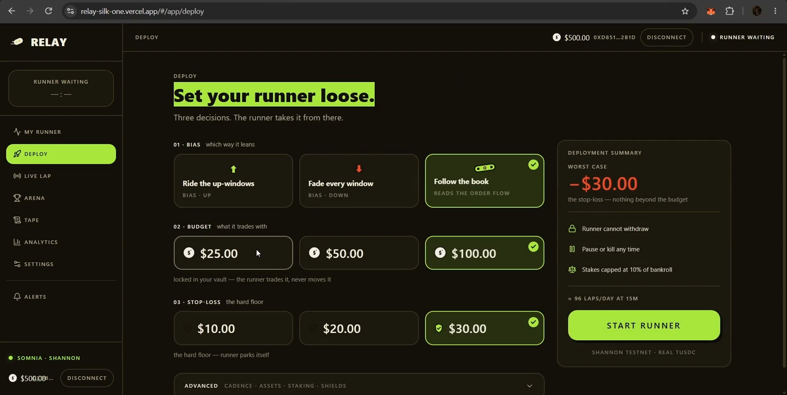

<p align="center"><sub>Three decisions. The runner takes it from there. Shannon tUSDC.</sub></p>

### Live Lap — real ETH window

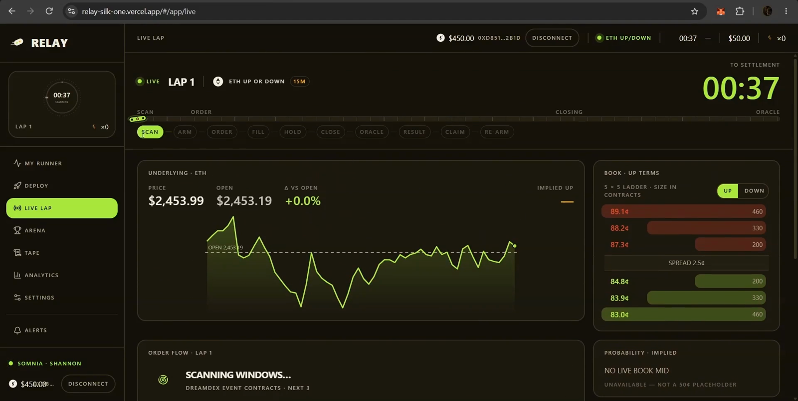

<p align="center"><sub>Live Lap against a real Event Contract book. Empty books stay empty — no $0 placeholder ladder.</sub></p>

### Fill

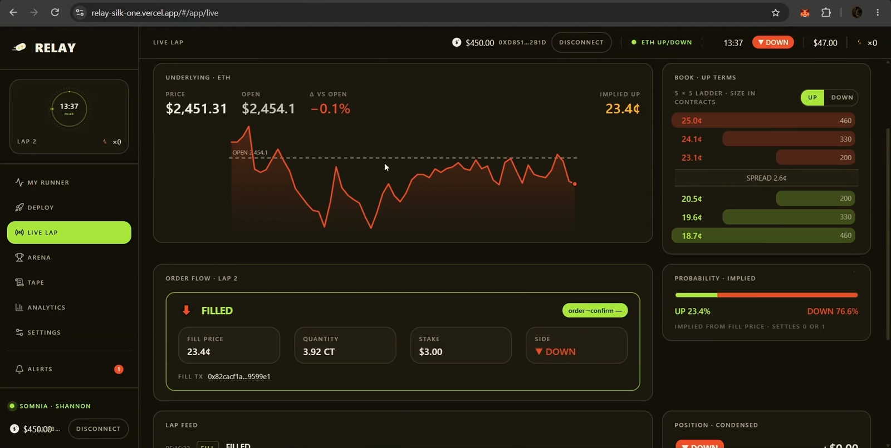

<p align="center"><sub>FILLED with fill tx `0x82cacf1a…599e1` on the order card.</sub></p>

### Result + proof

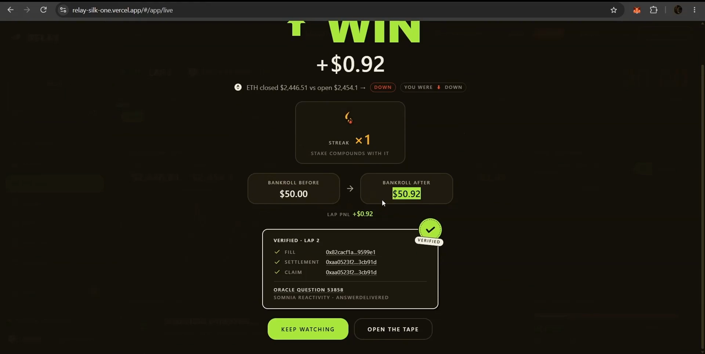

<p align="center"><sub>Autonomous settlement: fill, settlement, and claim hashes on the WIN card. PnL +$0.92 from redeem, not a painted number.</sub></p>

### Tape

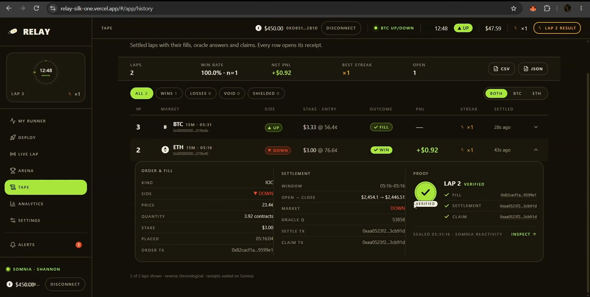

<p align="center"><sub>Every settled row opens a receipt. Oracle Q 53858 is Shannon-scoped.</sub></p>

### Analytics

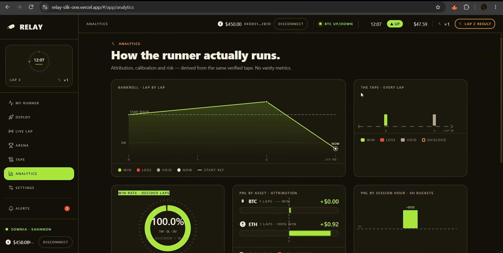

<p align="center"><sub>Bankroll and win rate from the same verified tape. No second ledger.</sub></p>

### Oracle proof

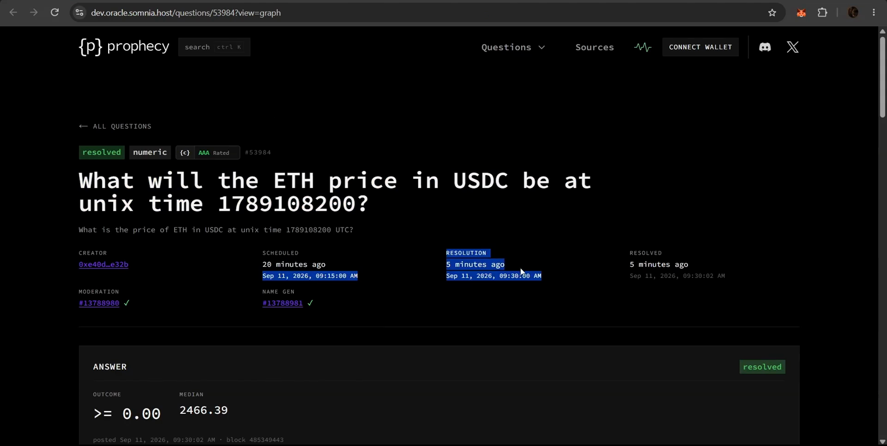

<p align="center"><sub>Shannon Prophecy Q 53984 on `dev.oracle.somnia.host` — the host RELAY actually uses.</sub></p>

### Arena

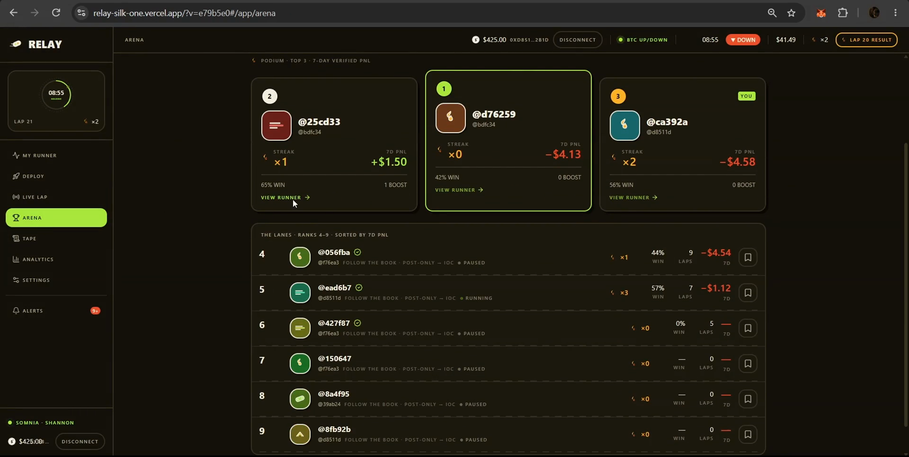

<p align="center"><sub>Public verified leaderboard. Rank is tape, not followers. Numbers move as laps settle.</sub></p>

### Boost

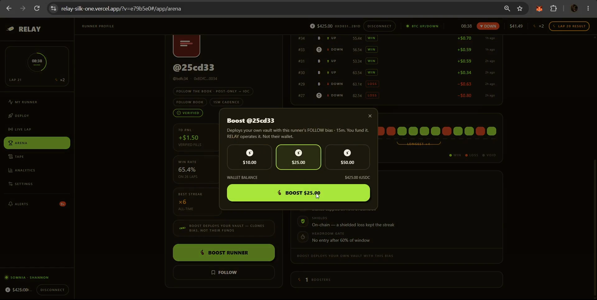

<p align="center"><sub>Boost deploys *your* vault with the leader’s bias. RELAY operates it. Not their wallet.</sub></p>

---

## Requirements

- Node.js 20+
- pnpm 10+
- Foundry (`forge`) for contract tests
- A gitignored `.env` copied from `.env.example`

## Setup

```bash
pnpm install
cp .env.example .env
# fill local values — never commit .env
git clone --depth 1 https://github.com/foundry-rs/forge-std contracts/lib/forge-std
```

## Commands

```bash
pnpm doctor              # environment + live protocol checks (fail-closed)
pnpm harness             # read-only Shannon SDK + on-chain market/book probe
pnpm faucet              # Shannon STT/tUSDC faucet (SDK realtime path)
pnpm deploy:shannon      # deploy vault/registry/manager
pnpm vault:fund         # deposit/withdraw + scratch kill
pnpm place:shannon       # POST_ONLY then IOC with OrderFilled classification
pnpm settle:shannon      # resolution backstop + redeem
pnpm reactivity:probe    # isolated BlockTick handler (32 STT, then withdraw)
pnpm gold:e2e            # fill → wait → settle/redeem → autonomous lap 2
pnpm db:migrate          # Postgres schema
pnpm api                 # health + runner/proof/network API
pnpm worker              # single-writer agent with SKIP LOCKED
pnpm start               # API + worker (Render web process)
pnpm test
pnpm typecheck
pnpm check:frontend-mocks
pnpm verify 0x25cdBDbE9ca3eC7ea027D422dFA5440c0Dc9D133
pnpm isolation:owners
forge test
```

Doctor prints `PASS` / `WARN` / `FAIL` only. It never prints private keys or passwords.

Public frontend env **names** (values stay in gitignored files): `NEXT_PUBLIC_RELAY_API_URL`, `NEXT_PUBLIC_PRIVY_APP_ID`, `NEXT_PUBLIC_NETWORK`, `NEXT_PUBLIC_CHAIN_ID`. Never put operator keys or database URLs in `NEXT_PUBLIC_*`. Vercel Root Directory is `frontend`; build command is `pnpm exec next build`.

## Layout

```
apps/api         HTTP health, network, owner-scoped runners, proof/history, SSE
apps/worker      Multi-vault agent (discover → fill → settle → re-arm)
packages/core    SDK pin, doctor, deploy, execution, settlement
packages/db      Postgres migrations + SKIP LOCKED leases
contracts/       Foundry (RunnerVault, RelayRegistry, ReactivityManager, BoostController)
frontend/        Next.js app (Privy + live API; no production mocks)
scripts/         operator scripts
```

## License

UNLICENSED until otherwise stated.
